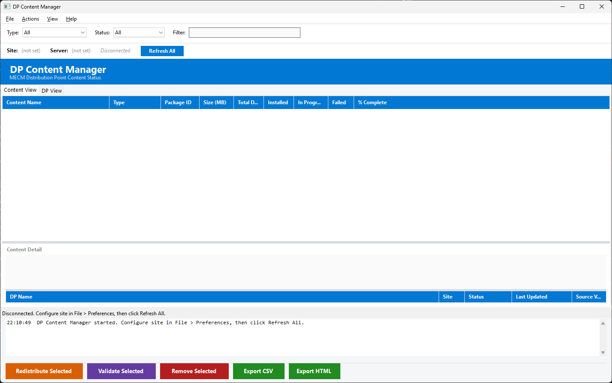

# DP Content Manager

A WinForms-based PowerShell GUI for managing MECM (Configuration Manager) distribution point content across large environments. View content status across all DPs, redistribute failed content, remove orphaned content, validate integrity, and analyze storage.



## Requirements

- Windows 10/11
- PowerShell 5.1
- .NET Framework 4.8+
- Configuration Manager console installed (ConfigurationManager PowerShell module)

## Quick Start

```powershell
powershell -ExecutionPolicy Bypass -File start-dpcontentmgr.ps1
```

1. Open **File > Preferences** and enter your Site Code and SMS Provider
2. Click **Refresh All** to connect and load data

## Features

### Dual View

| View | Primary Axis | Detail Panel |
|------|-------------|--------------|
| **Content View** | Rows = content objects (apps, packages, SUDPs, etc.) with per-DP status counts | Per-DP breakdown for selected content |
| **DP View** | Rows = distribution points with content status counts and total size | Content list for selected DP |

### Content Types

- Applications
- Packages (legacy)
- Software Update Deployment Packages
- Boot Images
- OS Images
- Driver Packages
- Task Sequence referenced content

### Scale-Optimized Status Queries

Uses a single WMI bulk query (`SMS_PackageStatusDistPointsSummarizer`) to retrieve all content-to-DP status in one call, with O(n) hashtable aggregation. Designed for 300+ DP environments where per-object CM cmdlet iteration would take 40+ minutes.

### Actions

- **Redistribute Selected** -- Redistribute failed content to its failed DPs
- **Validate Selected** -- Trigger server-side content integrity validation (hash check)
- **Remove Selected** -- Remove content from all its distribution points
- **Remove Orphaned** -- Detect and remove content on DPs that no longer has a source object in MECM

### Storage Analysis

View > Storage Analysis opens a sorted breakdown of estimated content size per DP with export to CSV.

### Filtering

- Content type dropdown (All, Application, Package, SU Deployment Pkg, etc.)
- Status filter (All, Failed Only, In Progress, Installed)
- Real-time text filter across content name and package ID

### Export & Reporting

- **CSV** -- Full grid data for the active tab
- **HTML** -- Self-contained styled report with color-coded status cells

### UI

- Dark mode and light mode with full theme support
  - Custom ToolStrip renderer (no light borders/gradients in dark mode)
  - Owner-draw tab headers
- Color-coded grid rows (red = failed, orange = in progress)
- Detail panels with RichTextBox info and sub-grids
- Live log console showing operation progress
- Window position, size, splitter distance, and active tab persistence across sessions

## Project Structure

```
dpcontentmgr/
  start-dpcontentmgr.ps1          Main WinForms application
  Module/
    DPContentMgrCommon.psd1       Module manifest (v1.0.0)
    DPContentMgrCommon.psm1       Core module (27 exported functions)
  Logs/                           Session logs (auto-created)
  Reports/                        Exported reports
```

## Preferences

Stored in `DPContentMgr.prefs.json`. Accessible via File > Preferences.

| Setting | Description |
|---------|-------------|
| DarkMode | Toggle dark/light theme (requires restart) |
| SiteCode | 3-character MECM site code |
| SMSProvider | SMS Provider server hostname |

## License

This project is licensed under the [GNU General Public License v3.0](LICENSE).

## Author

Jason Ulbright
