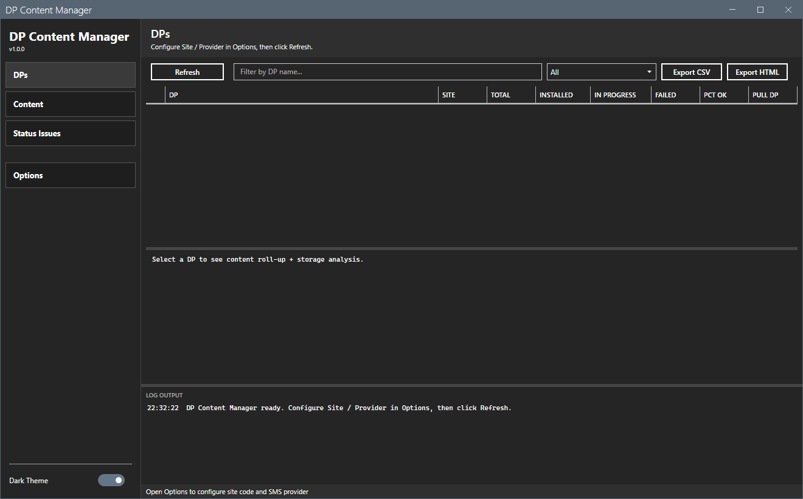

# DP Content Manager

A MahApps.Metro WPF GUI for managing MECM distribution point content at scale: per-DP and per-content rollups, a triage view for non-OK rows, bulk redistribute / remove / validate with mandatory preview-before-commit, and CSV / HTML export.



## Requirements

- Windows 10 / 11 or Server 2016+
- PowerShell 5.1
- .NET Framework 4.7.2+
- Configuration Manager console installed (provides the `ConfigurationManager` PowerShell module)
- MECM RBAC rights to read DP content + redistribute / remove content

## Quick Start

1. Download the release zip and extract it to a working folder.
2. Right-click `start-dpcontentmgr.ps1` -> **Run with PowerShell**, or from a PowerShell prompt:

   ```powershell
   powershell -ExecutionPolicy Bypass -File start-dpcontentmgr.ps1
   ```
3. Click **Options** on the sidebar and set Site Code and SMS Provider.
4. Click **Refresh** to load DPs, content, and bulk distribution status.

## Layout

The shell uses a sidebar layout with three views and an Options modal:

- **DPs** -- per-DP rollup grid: glyph status, DP, site, total content, installed, in progress, failed, % OK, Pull DP. Detail panel shows storage analysis (TotalSizeGB) for the selected DP.
- **Content** -- per-content-object rollup: glyph, name, type, PackageID, size, DPs targeted, installed, failed, % OK. Selecting a row populates a per-DP status grid below. Action buttons: Redistribute Failed, Remove from DP, Validate.
- **Status Issues** -- the triage view: every (DP, Content) row currently in a non-OK state. Multi-select + Redistribute Selected or Remove Failures for bulk remediation.

## Content Types

- Applications
- Packages (legacy)
- Software Update Deployment Packages (SUDPs)
- Boot Images
- OS Images
- Driver Packages
- Task Sequence referenced content

## Bulk Operation Safety

Every destructive bulk action (Redistribute, Remove from DP, Validate) opens a preview dialog showing the **full (DP, Content) impact list** before running. Click **Run N operations** to execute per-row with live OK / FAIL status and per-row error detail. The dialog's "Close" only enables AFTER the run completes -- so accidental "remove all failed across 200 DPs" without seeing the list first is impossible.

## Scale-Optimized Status Queries

Bulk status uses a single CIM query against `SMS_PackageStatusDistPointsSummarizer` instead of iterating per-content cmdlets, with O(n) hashtable aggregation in the module. Designed for 300+ DP environments where per-object iteration would take 40+ minutes.

> **Why CIM here:** No ConfigurationManager PowerShell cmdlet exposes bulk per-DP content state across all content objects. The summarizer class is the only way to get this data in a single query. All other operations (content retrieval, validation, removal) use CM cmdlets.

## Filtering

- **DPs view** -- text filter on DP name + status filter (All / Healthy only / Has failures / Has in-progress)
- **Content view** -- text filter on content name or PackageID + content-type filter (All / Application / Package / SUDP / BootImage / OSImage / DriverPackage / TaskSequence)
- **Status Issues view** -- text filter on DP or content name + state filter (All / Failed only / In progress only)

## Export

CSV and HTML export of the active view. Files land under `Reports/` by default.

## Project Structure

```
dp-content-manager/
+- start-dpcontentmgr.ps1                    # WPF shell
+- MainWindow.xaml                           # Main window layout
+- Lib/                                      # Vendored MahApps.Metro 2.4.10
|  \- SuiteCommon/                           # Vendored shared core: logging + CM connection
+- Module/
|  +- DPContentMgrCommon.psd1                # Module manifest
|  \- DPContentMgrCommon.psm1                # Business logic (21 functions)
+- Logs/                                     # Session logs (per-run)
+- Reports/                                  # CSV / HTML exports
+- CHANGELOG.md
+- LICENSE
\- README.md
```

## Safety

- All bulk destructive operations are gated by the preview-before-commit dialog.
- WMI bulk-status query is read-only.
- Refresh uses a background runspace so the UI stays responsive during 30s+ enumerations on large sites.
- Per-action CM cmdlets (`Invoke-CMContentRedistribution`, `Remove-CMContentDistribution`, `Invoke-CMContentValidation`) all use the supported ConfigurationManager PowerShell module.

## License

This project is licensed under the [MIT License](LICENSE).

## Author

Jason Ulbright
